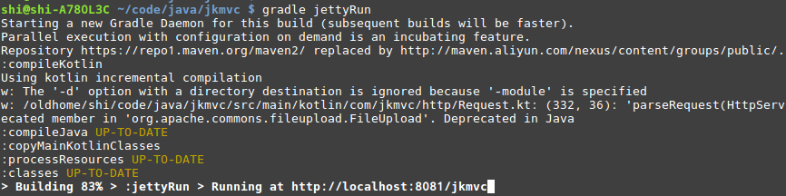
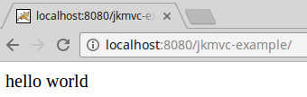
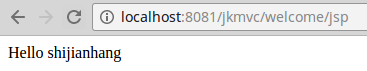
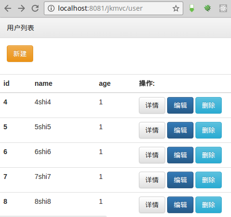
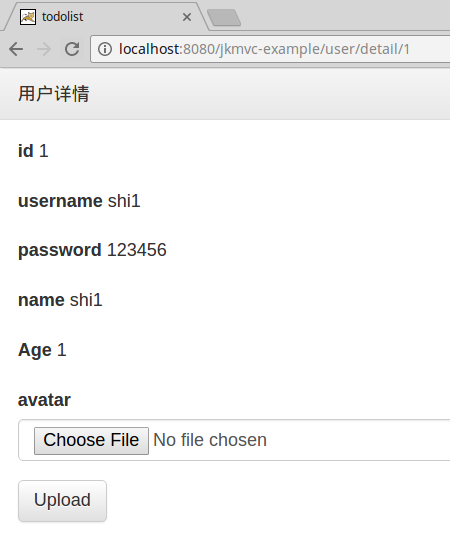
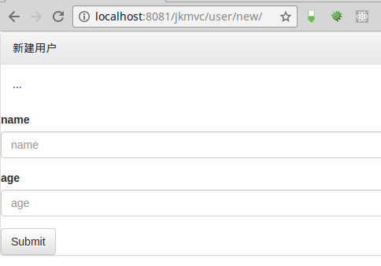
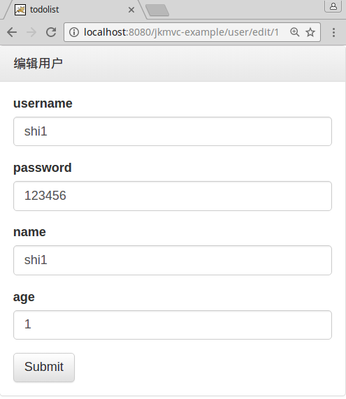

# jkmvc
Jkmvc is an elegant, powerful and lightweight MVC web framework built using kotlin. It aims to be swift, secure, and small. It will turn java's heavy development into kotlin's simple pleasure.

Inspired by 2 php frameworks: [kohana](https://github.com/kohana/kohana) and [skmvc](https://github.com/shigebeyond/skmvc)

[Document](#Document)

[中文文档](#中文文档)

# Introduction - web

Take `jkmvc/jkmvc-example` for example.

## 1 Configure JkFilter in web.xml

JkFilter is a Filter for your web application

vim src/main/webapp/WEB-INF/web.xml

```
<?xml version="1.0" encoding="UTF-8"?>
<web-app xmlns:xsi="http://www.w3.org/2001/XMLSchema-instance" xmlns="http://java.sun.com/xml/ns/javaee" xmlns:web="http://java.sun.com/xml/ns/javaee/web-app_2_5.xsd" xsi:schemaLocation="http://java.sun.com/xml/ns/javaee http://java.sun.com/xml/ns/javaee/web-app_2_5.xsd" id="WebApp_ID" version="2.5">
	<filter>
		<filter-name>jkmvc</filter-name>
		<filter-class>net.jkcode.jkmvc.http.JkFilter</filter-class>
	</filter>

	<filter-mapping>
		<filter-name>jkmvc</filter-name>
		<url-pattern>/*</url-pattern>
	</filter-mapping>
</web-app>
```

## 2 Create Controller

Controller handles request, and render data to response.

It has property `req` to represent request, `res` to represent response.

```
package net.jkcode.jkmvc.example.controller

import net.jkcode.jkmvc.http.Controller

/**
 * 主页
 */
class WelcomeController: Controller() {

    /**
     * 主页
     */
    public fun indexAction() {
        res.renderString("hello world");
    }

}
```

## 3 Register Controller

configure controller classes's package paths

vim src/main/resources/http.yaml

```
# controller类所在的包路径
# controller classes's package paths
controllerPackages:
    - net.jkcode.jkmvc.example.controller
```

## 4 Config jetty gradle plugin

vim build.gradle

```
apply plugin: 'org.akhikhl.gretty'

// 启动jetty
gretty{
    // server 配置
    servletContainer 'jetty9' // 'tomcat8'
    httpPort 8080
    managedClassReload true // 热部署
    scanInterval 1 // 热部署的扫描间隔，当值为0时，不扫描新class，不热部署

    // 调试: gradle appRunDebug
    debugPort 5006 // 运行jetty的jvm独立于运行gradle的jvm, 因此也使用独立的调试端口
    debugSuspend true

    // webapp 配置
    contextPath "/${project.name}"
    inplaceMode "hard" // 资源目录 src/main/webapp
}
```

## 5 Run web server

`gradle jettyRun -x test`



## 6 Visit web page

visit http://localhost:8080/jkmvc-example/



# Introduction - view

## 1 Render View in Controller

```
package net.jkcode.jkmvc.example.controller

import net.jkcode.jkmvc.http.Controller

/**
 * 主页
 */
class WelcomeController: Controller() {

    /**
     * 显示jsp视图
     * render jsp view
     */
    public fun jspAction(){
        res.renderView(view("index" /* view file */, mutableMapOf("name" to "shijianhang") /* view data */))
    }

}
```

## 2 Create jsp view

I regret that we cannot write kotlin in jsp.

vim src/main/webapp/index.jsp

```
<%@ page language="java" contentType="text/html; charset=UTF-8"
    pageEncoding="UTF-8"%>
<!DOCTYPE html>
<html>
<head>
<meta charset="utf-8">
<title>jkmvc</title>
</head>
<body>
Hello <%= request.getAttribute("name") %><br/>
</body>
</html>
```

## 3 Visit web page

visit http://localhost:8080/jkmvc-example/welcome/jsp




# Introduction - orm

Orm　provides object-oriented way to mainpulate db data.

It has 2 concepts:

1 Orm meta data: include information as follows

1.1 mapping from object to table

1.2 mapping from object's property to table's column

1.3 mapping from object's property to other object

2 Orm object | Model

2.1 visit property

you can use operator `[]` to visit orm object's property, and also use property delegate `public var id:Int by property<Int>();` to visit it

2.2 method

`queryBuilder()` return a query builder to query data from table

`create()` create data

`update()` update data

`delete()` delete data

## 1 Create tables

user table

```
CREATE TABLE `user` (
  `id` int(11) unsigned NOT NULL AUTO_INCREMENT COMMENT '用户编号',
  `name` varchar(50) NOT NULL DEFAULT '' COMMENT '用户名',
  `age` tinyint(4) unsigned NOT NULL DEFAULT '0' COMMENT '年龄',
  `avatar` varchar(250) DEFAULT NULL COMMENT '头像',
  PRIMARY KEY (`id`)
) ENGINE=InnoDB AUTO_INCREMENT=35 DEFAULT CHARSET=utf8 COMMENT='用户'
```

address table

```
CREATE TABLE `address` (
  `id` int(11) unsigned NOT NULL AUTO_INCREMENT COMMENT '地址编号',
  `user_id` int(11) unsigned NOT NULL COMMENT '用户编号',
  `addr` varchar(50) NOT NULL DEFAULT '' COMMENT '地址',
  `tel` varchar(50) NOT NULL DEFAULT '' COMMENT '电话',
  `name` varchar(50) NOT NULL DEFAULT '' COMMENT '用户名',
  PRIMARY KEY (`id`)
) ENGINE=InnoDB AUTO_INCREMENT=29 DEFAULT CHARSET=utf8 COMMENT='地址';
```

## 2 Create Model

use model, extends Orm

```
package net.jkcode.jkmvc.example.model

import net.jkcode.jkmvc.orm.OrmMeta
import net.jkcode.jkmvc.orm.Orm

/**
 * 用户模型
 * User　model
 */
class UserModel(id:Int? = null): Orm(id) {
    // 伴随对象就是元数据
    // company object is meta data for model
    companion object m: OrmMeta(UserModel::class){
        init {
            // 添加标签 + 规则
            // add label and rule for field
            addRule("name", "姓名", "notEmpty");
            addRule("age", "年龄", "between(1,120)");

            // 添加关联关系
            // add relaction for other model
            hasOne("address", AddressModel::class)
            hasMany("addresses", AddressModel::class)
        }
    }

    // 代理属性读写
    // delegate property
    public var id:Int by property<Int>();

    public var name:String by property<String>();

    public var age:Int by property<Int>();

    public var avatar:String? by property<String?>();

    // 关联地址：一个用户有一个地址
    // relate to AddressModel: user has an address
    public var address:AddressModel by property<AddressModel>();

    // 关联地址：一个用户有多个地址
    // relate to AddressModel: user has many addresses
    public var addresses:List<AddressModel> by property<List<AddressModel>>();
}
```

address model, extends Orm

```
package net.jkcode.jkmvc.example.model

import net.jkcode.jkmvc.orm.OrmMeta
import net.jkcode.jkmvc.orm.Orm

/**
 * 地址模型
 */
class AddressModel(id:Int? = null): Orm(id) {
    // 伴随对象就是元数据
    // company object is meta data for model
    companion object m: OrmMeta(AddressModel::class){
        init {
            // 添加标签 + 规则
            // add label and rule for field
            addRule("user_id", "用户", "notEmpty");
            addRule("addr", "地址", "notEmpty");
            addRule("tel", "电话", "notEmpty && digit");

            // 添加关联关系
            // add relaction for other model
            belongsTo("user", UserModel::class, "user_id")
        }
    }

    // 代理属性读写
    // delegate property
    public var id:Int by property<Int>();

    public var user_id:Int by property<Int>();

    public var addr:String by property<String>();

    public var tel:String by property<String>();

    // 关联用户：一个地址从属于一个用户
    public var user:UserModel by property<UserModel>()
}
```

## 3 Use Model in Controller

```
package net.jkcode.jkmvc.example.controller

import net.jkcode.jkmvc.common.format
import net.jkcode.jkmvc.common.httpLogger
import net.jkcode.jkmvc.example.model.UserModel
import net.jkcode.jkmvc.http.controller.Controller
import net.jkcode.jkmvc.http.fromRequest
import net.jkcode.jkmvc.http.isPost
import net.jkcode.jkmvc.http.isUpload
import net.jkcode.jkmvc.http.session.Auth
import net.jkcode.jkmvc.orm.OrmQueryBuilder
import net.jkcode.jkmvc.orm.isLoaded
import java.util.*


/**
 * 用户管理
 * user manage
 */
class UserController: Controller()
{
    /**
     * action前置处理
     */
    public override fun before() {
        // 如检查权限
        httpLogger.info("action前置处理")
    }

    /**
     * action后置处理
     */
    public override fun after() {
        // 如记录日志
        httpLogger.info("action后置处理")
    }

    /**
     * 列表页
     * list page
     */
    public fun indexAction()
    {
        val query: OrmQueryBuilder = UserModel.queryBuilder()
        // 统计用户个数 | count users
        val counter:OrmQueryBuilder = query.clone() as OrmQueryBuilder // 复制query builder
        val count = counter.count()
        // 查询所有用户 | find all users
        val users = query.findAllModels<UserModel>()
        // 渲染视图 | render view
        res.renderView(view("user/index", mutableMapOf("count" to count, "users" to users)))
    }

    /**
     * 详情页
     * detail page
     */
    public fun detailAction()
    {
        // 获得路由参数id: 2种写法 | 2 ways to get route parameter: "id"
        // val id = req.getIntRouteParameter("id"); // req.getRouteParameter["xxx"]
        val id:Int? = req["id"] // req["xxx"]
        // 查询单个用户 | find a user
        //val user = UserModel.queryBuilder().where("id", id).findModel<UserModel>()
        val user = UserModel(id)
        if(!user.isLoaded()){
            res.renderString("用户[$id]不存在")
            return
        }
        // 渲染视图 | render view
        val view = view("user/detail")
        view["user"] = user; // 设置视图参数 | set view data
        res.renderView(view)
    }

    /**
     * 新建页
     * new page
     */
    public fun newAction()
    {
        // 处理请求 | handle request
        if(req.isPost()){ //  post请求：保存表单数据 | post request: save form data
            // 创建空的用户 | create user model
            val user = UserModel()
            // 获得请求参数：3种写法 | 3 ways to get request parameter
            /* // 1 req.getParameter("xxx");
            user.name = req.getParameter("name")!!;
            user.age = req.getIntParameter("age", 0)!!; // 带默认值 | default value
            */
            // 2 req["xxx"]
            user.name = req["name"]!!;
            user.age = req["age"]!!;

            // 3 Orm.fromRequest(req)
            user.fromRequest(req)
            user.create(); // create user
            // 重定向到列表页 | redirect to list page
            redirect("user/index");
        }else{ // get请求： 渲染视图 | get request: render view
            val view = view() // 默认视图为action名： user/new | default view's name = action：　user/new
            res.renderView(view)
        }
    }

    /**
     * 编辑页
     * edit page
     */
    public fun editAction()
    {
        // 查询单个用户 | find a user
        val id: Int = req["id"]!!
        val user = UserModel(id)
        if(!user.isLoaded()){
            res.renderString("用户[" + req["id"] + "]不存在")
            return
        }
        // 处理请求 | handle request
        if(req.isPost()){ //  post请求：保存表单数据 | post request: save form data
            // 获得请求参数：3种写法 | 3 way to get request parameter
            /* // 1 req.getParameter("xxx");
            user.name = req.getParameter("name")!!;
            user.age = req.getIntParameter("age", 0)!!; // 带默认值 | default value
            */
            /*// 2 req["xxx"]
            user.name = req["name"]!!;
            user.age = req["age"]!!;
            */
            // 3 Orm.fromRequest(req)
            user.fromRequest(req)
            user.update() // update user
            // 重定向到列表页 | redirect to list page
            redirect("user/index");
        }else{ // get请求： 渲染视图 | get request: render view
            val view = view() // 默认视图为action名： user/edit | default view's name = action：　user/edit
            view["user"] = user; // 设置视图参数 |  set view data
            res.renderView(view)
        }
    }

    /**
     * 删除
     * delete action
     */
    public fun deleteAction()
    {
        val id:Int? = req["id"]
        // 查询单个用户 | find a user
        val user = UserModel(id)
        if(!user.isLoaded()){
            res.renderString("用户[$id]不存在")
            return
        }
        // 删除 | delete user
        user.delete();
        // 重定向到列表页 | redirect to list page
        redirect("user/index");
    }

    /**
     * 上传头像
     * upload avatar
     */
    public fun uploadAvatarAction()
    {
        // 设置上传的子目录（将上传文件保存到指定的子目录），必须要在调用 req 的其他api之前调用，否则无法生效
        // set uploadSubdir which uploaded file is saved, you must set it before calling req's other api, or it's useless
        req.uploadSubdir = "avatar/" + Date().format("yyyy/MM/dd")

        // 查询单个用户 | find a user
        val id: Int = req["id"]!!
        val user = UserModel(id)
        if(!user.isLoaded()){
            res.renderString("用户[" + req["id"] + "]不存在")
            return
        }

        // 检查并处理上传文件 | check and handle upload request
        if(req.isUpload()){ // 检查上传请求 | check upload request
            user.avatar = req.getPartFileRelativePath("avatar")!!
            user.update()
        }

        // 重定向到详情页 | redirect to detail page
        redirect("user/detail/$id");
    }

    /**
     * 登录
     */
    public fun loginAction(){
        if(req.isPost()){ // post请求
            val user = Auth.instance().login(req["username"]!!, req["password"]!!);
            if(user == null)
                res.renderString("登录失败")
            else
                redirect("user/login")
        }else{ // get请求
            res.renderView(view())
        }
    }

    /**
     * 登录
     */
    public fun logoutAction(){
        Auth.instance().logout()
        redirect("user/login")
    }
}
```

# demo

download source and run web server

```
git clone https://github.com/shigebeyond/jkmvc.git
cd jkmvc
gradle :jkmvc-example:jettyRun
```

visit url

http://localhost:8080/jkmvc-example/user/index



http://localhost:8080/jkmvc-example/user/detail



http://localhost:8080/jkmvc-example/user/new



http://localhost:8080/jkmvc-example/user/edit



# gradle command for build

```
gradle :jkmvc-common:build -x test
gradle :jkmvc-orm:build -x test
gradle :jkmvc-http:build -x test
gradle :jkmvc-example:build -x test
```

# Document

## http module
1. [getting started](doc/http/getting_started.md)
2. [controller](doc/http/controller.md)
3. [request](doc/http/request.md)
4. [response](doc/http/response.md)
5. [route](doc/http/route.md)
6. [upload](doc/http/upload.md)
7. [request handling flow](doc/http/flow.md)

## db module
8. [getting started](doc/db/getting_started.md)
9. [query](doc/db/query.md)
10. [query builder](doc/db/query_builder.md)
11. [db expression](doc/db/expr.md)

## orm module
12. [getting_started](doc/orm/getting_started.md)
13. [model](doc/orm/model.md)
14. [relation](doc/orm/relation.md)
15. [validation](doc/orm/validation.md)
16. [using](doc/orm/using.md)

## common module
17. [deploy](doc/common/deploy.md)
18. [config](doc/common/config.md)
19. [validation_expression](doc/common/validation/validation_expression.md)
20. [validation](doc/common/validation/validation.md)

# 中文文档

## http模块
1. [快速开始](doc/http/getting_started.cn.md)
2. [控制器](doc/http/controller.cn.md)
3. [请求](doc/http/request.cn.md)
4. [响应](doc/http/response.cn.md)
5. [路由](doc/http/route.cn.md)
6. [上传](doc/http/upload.cn.md)
7. [请求处理流程](doc/http/flow.cn.md)

## db模块
8. [快速开始](doc/db/getting_started.cn.md)
9. [查询](doc/db/query.cn.md)
10. [sql构建器](doc/db/query_builder.cn.md)
11. [db表达式](doc/db/expr.cn.md)

## orm模块
12. [快速开始](doc/orm/getting_started.cn.md)
13. [模型](doc/orm/model.cn.md)
14. [关联关系](doc/orm/relation.cn.md)
15. [校验](doc/orm/validation.cn.md)
16. [使用](doc/orm/using.cn.md)

## 公共
17. [部署](doc/common/deploy.cn.md)
18. [配置](doc/common/config.cn.md)
19. [缓存](doc/common/cache.cn.md)
20. [锁](doc/common/lock.cn.md)
21. [序列化](doc/common/serializer.cn.md)
22. [校验器](doc/common/validation/validation.cn.md)
23. [校验表达式](doc/common/validation/validation_expression.cn.md)
24. [id生成器](doc/common/idworker.cn.md)

## 其他
25. [changelog](doc/changelog.md)