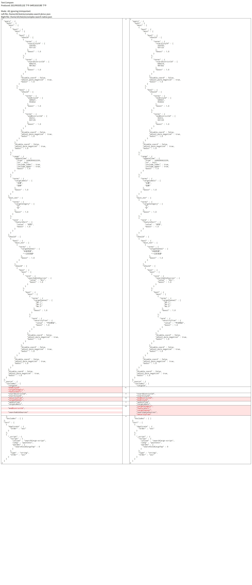
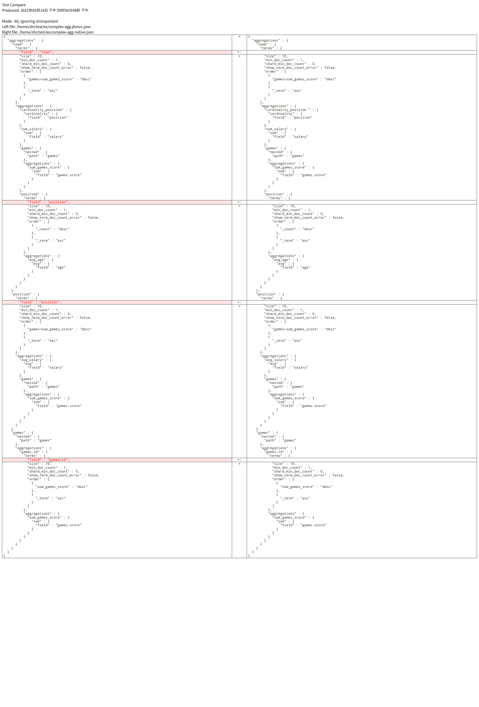

# EsQueryBuilder 查询构建器
es查询构建器，是通过提供类sql的一系列方法，来帮助开发者快速构建原生es查询dsl, 能够大大简化各种复杂的查询.

## 1 实例化查询构建器

直接创建`EsQueryBuilder`对象, 第一个参数是 `EsManager` 对象. 

```kotlin
val query = EsQueryBuilder(EsManager.instance())
val query = EsQueryBuilder() // 第一个参数有默认值 EsManager.instance()
```

## 2 查询

### 2.1 `index()` 指定索引名, `type()` 指定索引类型
es7以后废弃type, 默认都是`_doc`,
因此EsQueryBuilder中可以不指定type, 默认取`_doc`

```kotlin
query.index("user_index").type("_doc") 
```

### 2.2 `filter()`/`must()`/`mustNot()`/`should()` 条件

我们使用`filter()`/`must()`/`mustNot()`/`should()`方法来过滤查询结果。这些方法需要3个参数： 1 字段名 2 操作符 3 字段值. 

```kotlin
query.filter("username", "=", "john");
```

多次调用 `filter()`/`must()`/`mustNot()`/`should()` 方法会构建多个过滤条件, 并按对应方法名来分组条件, 可参考 `BoolQueryBuilder` 对应的 `filter()`/`must()`/`mustNot()`/`should()` 方法

```kotlin
query.should("username", "=", "john").should("username", "=", "jane");
```

你可以使用任意的操作符，如 `IN`, `BETWEEN`, `>`, `=<`, `!=`...  

如果你使用的是多值操作符，则字段值需要传递数组`Array`或列索引`List`

```kotlin
query.filter("logins", "<=", 1);
query.must("logins", ">", 50);

// in
query.mustNot("username", "IN", arrayOf("john","mark","matt"));

// between
query.should("joindate", "BETWEEN", Pair(then, now)); // 等价于下面语句
query.shouldBetween("joindate", then, now);


// like = match (搜索的词被分词)
query.must("username", "like", "John Wilson"); // 等价于下面语句
query.must("username", "match", "John Wilson");

// matchPhrase (搜索的词不分词)
query.must("username", "matchPhrase", "John");
```

### 2.3 `select()` 字段名

默认情况下，Select语句会select全部字段（`SELECT * ...`）, 但是你也可以通过调用`EsQueryBuilder::select()` 来指定返回的字段

```kotlin
query.select("username", "password").index("user_index").type("_doc").must("username", "=", "john");
```

我们来解释一下上面的链式方法调用。首先，我们调用`select()` 来指定返回的字段；其次，我们调用 `index()` 来指定要查询的索引；最后，我们调用 `where()` 来搜索我们想要的数据。

生成es查询dsl如下

```json
POST user_index/_doc/_search
{
  "query" : {
    "bool" : {
      "must" : [
        {
          "term" : {
            "username" : {
              "value" : "john",
              "boost" : 1.0
            }
          }
        }
      ],
      "disable_coord" : false,
      "adjust_pure_negative" : true,
      "boost" : 1.0
    }
  },
  "_source" : {
    "includes" : [
      "password",
      "username"
    ],
    "excludes" : [ ]
  }
}
```

### 2.4 `limit()` 限制行数

有时候我们查询的索引里有大量数据，但通常我们只需要某几行数据。此时通过调用 `limit(start:Int, offset:Int = 0)` 方法来限制返回某几行

```kotlin
query.index("post_index").limit(10, 30);
```

生成es查询dsl如下：

```json
POST post_index/_doc/_search
{
  "from" : 30,
  "size" : 10
}
```

### 2.5 `orderByField()` 排序

你可以需要返回的数据按某个顺序来排列，如按时间倒序/按分数生序。 你可以调用 `orderByField(column:String, direction:String? = null)` 来实现排序，该方法需要2个参数： 1 排序字段名 2 排序方法（可选，默认为`ASC`）。多次调用 `orderByField()` 会追加多个排序字段。

```kotlin
query.index("post_index").orderByField(`published`, `DESC`);
```

生成es查询dsl如下：

```json
{
  "from" : 30,
  "size" : 10
}
```

### 2.6 执行查询，并获得结果

```kotlin
val query = EsQueryBuilder().index("user_index").type("_doc")

// 查询单个文档
val user: User? = query.searchDoc(User::class.java)

// 查询多个文档
val (users, size) = query.searchDocs(User::class.java) // users类型是List<User>, size类型是Long

// 统计行数
val count: Long = query.count()
```


## 3 批量更新

如果你要通过查询来批量更新文档, 则可以`EsQueryBuilder.updateDocs(script)`, 其中参数`script`是文档更新的脚本, 详情参考[Update By Query API](https://www.elastic.co/guide/en/elasticsearch/reference/current/docs-update-by-query.html)

```kotlin
val query = EsQueryBuilder().index("post_index").must("_id", "1")
val f:Boolean = query.updateDocs("ctx._source.visit++") // 访问数+1
```

## 4 批量删除

如果你要通过查询来批量删除文档, 则可以`EsQueryBuilder.deleteDocs(script)`, 其内部实现是先通过游标搜索`EsManager#scrollDocs()`查询出匹配的文档id, 然后再通过`EsManager#bulkDeleteDocs()`来根据id删除文档.

```
val ids = EsQueryBuilder().index(index).type(type).deleteDocs()
println("删除" + ids.size + "个文档: id in " + ids)
```

## 嵌套条件

非常复杂的查询, 但使用 `EsQueryBuilder` 可以做到非常简单与可读

```kotlin
/**
 * 复杂查询
 *  对比 https://mp.weixin.qq.com/s/GFRiiQEk-JLpPnCi_WrRqw
 *      https://www.infoq.cn/article/u4Xhw5Q3jfLE1brGhtbR
 */
@Test
fun testComplexSearch() {
    val query = EsQueryBuilder()
            .index(index)
            .type(type)
            .mustWrap { // city
                mustWrap { // start city
                    should("startCityId", "IN", arrayOf(320705, 931125))
                    should("startDistrictId", "IN", arrayOf(684214, 981362))
                }
                mustWrap { // end city
                    should("endCityId", "IN", arrayOf(589421, 953652))
                    should("endDistrictId", "IN", arrayOf(95312, 931125))
                }
            }
            .must("updateTime", ">=", 1608285822239L) // range
            .must("cargoLabels", "IN", arrayOf("水果", "生鲜")) // cargoLabels

            .mustNot("cargoCategory", "IN", arrayOf("A", "B")) // cargoCategory
            .mustNot("featureSort", "=", "好货") // cargoCategory

            .shouldWrap {
                mustNot("cargoChannel", "IN", arrayOf("长途货源", "一口价货源")) // cargoChannel
                shouldWrap {
                    must("searchableSources", "=", "ALL") // searchableSources
                    mustWrap { // security
                        must("cargoChannel", "IN", arrayOf("No.1", "No.2", "No.3")) // cargoChannel
                        must("securityTran", "=", "平台保证") // securityTran
                    }
                }
            }

    query.select("cargoId", "startDistrictId", "startCityId", "endDistrictId", "endCityId", "updateTime", "cargoLabels",
            "cargoCategory", "featureSort", "cargoChannel", "searchableSources", "securityTran")

    query.orderByField("duplicate")
            .orderByScript("searchCargo-script", mapOf("searchColdCargoTop" to 0))

    // 执行搜索
    val (list, size) = query.searchDocs(RecentOrder::class.java)
    println("查到 $size 个文档")
    for (item in list)
        println(item)
}
```

而使用原生Java High Level REST Client接口方式, 非常复杂与难看, 光这么多个条件对应BoolQueryBuilder对象创建与命名与关联就够人喝一壶, 代码量近乎jkorm-es的2倍, 且代码远没有jkorm-es清晰易懂：

```java
// 构建query builder
final BoolQueryBuilder queryBuilder = QueryBuilders.boolQuery();
final TermsQueryBuilder startCityId = QueryBuilders.termsQuery("startCityId", Lists.newArrayList(320705L, 931125L));
final TermsQueryBuilder startDistrictId = QueryBuilders.termsQuery("startDistrictId", Lists.newArrayList(684214L, 981362L));
final TermsQueryBuilder endCityId = QueryBuilders.termsQuery("endCityId", Lists.newArrayList(589421L, 953652L));
final TermsQueryBuilder endDistrictId = QueryBuilders.termsQuery("endDistrictId", Lists.newArrayList(95312L, 931125L));
final BoolQueryBuilder startBuilder = QueryBuilders.boolQuery();
startBuilder.should(startCityId).should(startDistrictId);
final BoolQueryBuilder endBuilder = QueryBuilders.boolQuery();
endBuilder.should(endCityId).should(endDistrictId);
final BoolQueryBuilder cityBuilder = QueryBuilders.boolQuery();
cityBuilder.must(startBuilder);
cityBuilder.must(endBuilder);
queryBuilder.must(cityBuilder);
final RangeQueryBuilder rangeBuilder = QueryBuilders.rangeQuery("updateTime");
queryBuilder.must(rangeBuilder.from(1608285822239L));
final TermsQueryBuilder cargoLabelsBuilder = QueryBuilders.termsQuery("cargoLabels", Lists.newArrayList("水果", "生鲜"));
queryBuilder.must(cargoLabelsBuilder);
final TermsQueryBuilder cargoCategoryBuilder = QueryBuilders.termsQuery("cargoCategory", Lists.newArrayList("A", "B"));
final TermQueryBuilder featureSortBuilder = QueryBuilders.termQuery("featureSort", "好货");
queryBuilder.mustNot(cargoCategoryBuilder);
queryBuilder.mustNot(featureSortBuilder);
final BoolQueryBuilder cargoChannelBuilder = QueryBuilders.boolQuery();
queryBuilder.should(cargoChannelBuilder);
final TermsQueryBuilder channelBuilder = QueryBuilders.termsQuery("cargoChannel", Lists.newArrayList("长途货源", "一口价货源"));
cargoChannelBuilder.mustNot(channelBuilder);
final BoolQueryBuilder searchableSourcesBuilder = QueryBuilders.boolQuery();
cargoChannelBuilder.should(searchableSourcesBuilder);
final TermQueryBuilder sourceBuilder = QueryBuilders.termQuery("searchableSources", "ALL");
searchableSourcesBuilder.must(sourceBuilder);
final BoolQueryBuilder securityTranBuilder = QueryBuilders.boolQuery();
searchableSourcesBuilder.must(securityTranBuilder);
securityTranBuilder.must(QueryBuilders.termsQuery("cargoChannel", "No.1", "No.2", "No.3"));
securityTranBuilder.must(QueryBuilders.termQuery("securityTran", "平台保证"));

SearchSourceBuilder searchSource = new SearchSourceBuilder();
searchSource.query(queryBuilder);
searchSource.fetchSource(new String[]{"cargoId", "startDistrictId", "startCityId", "endDistrictId", "endCityId", "updateTime", "cargoLabels",
                "cargoCategory", "featureSort", "cargoChannel", "searchableSources", "securityTran"},
        new String[0]);
searchSource.sort("duplicate", SortOrder.ASC);
ScriptSortBuilder sortBuilder = SortBuilders.scriptSort(new org.elasticsearch.script.Script(ScriptType.INLINE,
        "painless", "searchCargo-script", Collections.emptyMap(), Collections.singletonMap("searchColdCargoTop", 0)),
        ScriptSortBuilder.ScriptSortType.STRING).order(SortOrder.ASC);
searchSource.sort(sortBuilder);

// 执行搜索
......
```

对比生成的es搜索DSL如下, 左边是jkorm-es生成代码, 右边是原生API生成代码

基本上一样, 只是select字段的顺序不同, 这是因为jkorm-es使用了HashSet(排重)来接收字段, 导致字段顺序变更
## 聚合
以下代码详细参考单元测试类`EsAggregationTests`

### 6.1 简单聚合
demo: 按照队伍team进行分组(桶)

```kotlin
@Test
public void testAgg(){
    // 构建聚合查询
    val query = EsQueryBuilder()
        .index(index)
        .type(type)
        .aggByAndWrapSubAgg("team") { // 别名是team
            aggBy("count(position)") // 别名是count_position
            aggBy("max(age)") // 别名是max_age
        }

    // 执行查询
    val result = query.searchDocs()

    // 转换聚合结果
    // 每个队伍 -- select count(1), count(position) as count_position, max(age) as max_age, team from player_index group by team;
    val teamRows = result.aggregations.flattenAggRows("team") // 将树型的聚合结果进行扁平化, 转为多行的Map, 每个Map的key是统计字段名, value是统计字段值
    println("统计每个队伍:" + teamRows)
}
```

而使用原生Java High Level REST Client接口方式
```java
// 构建聚合查询
val teamAgg = AggregationBuilders.terms("team ").field("team")
val posAgg = AggregationBuilders.count("count_position").field("position")
val ageAgg = AggregationBuilders.max("max_age").field("age")

SearchSourceBuilder searchSource = new SearchSourceBuilder();
searchSource.aggregation(teamAgg.subAggregation(posAgg).subAggregation(ageAgg))

// 执行查询
......
```

生成的es搜索DSL是一样的
```json
{
  "aggregations" : {
    "team " : {
      "terms" : {
        "field" : "team",
        "size" : 10,
        "min_doc_count" : 1,
        "shard_min_doc_count" : 0,
        "show_term_doc_count_error" : false,
        "order" : [
          {
            "_count" : "desc"
          },
          {
            "_term" : "asc"
          }
        ]
      },
      "aggregations" : {
        "count_position" : {
          "value_count" : {
            "field" : "position"
          }
        },
        "max_age" : {
          "max" : {
            "field" : "age"
          }
        }
      }
    }
  }
}
```

#### 解析聚合结果
方法 `net.jkcode.jkmvc.es._JestKt.path: String, aggValueCollector: (bucket: Bucket, row: MutableMap<String, Any>) -> Unit = ::handleSingleValueAgg): ArrayList<Map<String, Any>>` 将树型的聚合结果进行扁平化, 转为多行的Map, 每个Map的key是统计字段名, value是统计字段值;
如上面代码的结果输出如下:

```
统计每个队伍:[{max_age=28.0, count_position=4, count=4, team=湖人},
             {max_age=9.0, count_position=1, count=1, team=骑士}]
```

由此可见, 输出为多行的Map, Map的key是聚合字段名[team, count_position, max_age];
这种将树型聚合结果进行扁平化, 转为类似于select sql查询结果, 不用逐层去解析聚合结果, 方便开发者像往常一样开发, 简单易理解. 

限制: 只能收集单值聚合的结果, 其他聚合对象需手动收集

### 6.2 复杂聚合

```kotlin
@Test
fun testComplexAgg(){
    // 构建聚合查询
    val query = EsQueryBuilder()
            .index(index)
            .type(type)
            .aggByAndWrapSubAgg("team") { // 每个队伍 -- select count(position), sum(salary), sum(games.score), team from player_index group by team;
                aggBy("cardinality(position)") // 每个队伍总职位数
                aggBy("sum(salary)") // 每个队伍的总薪酬
                aggByAndWrapSubAgg("nested(games)") { // 每个队伍的总分 -- 嵌套文档
                    aggBy("sum(games.score)", null, false)
                }
                aggByAndWrapSubAgg("position"){ // 每个队伍+职位 -- select avg(age), team, position from player_index group by team, position;
                    aggBy("avg(age)")
                }
            }
            .aggByAndWrapSubAgg("position") { // 每个职位 -- select avg(salary), sum(games.score), position from player_index group by position; -- sum(games.score)不能执行
                aggBy("avg(salary)") // 每个职位的平均薪酬
                aggByAndWrapSubAgg("nested(games)") { // 每个职位的总分 -- 嵌套文档
                    aggBy("sum(games.score)", null, false)
                }
            }
            .aggByAndWrapSubAgg("nested(games)") { // 每场比赛 -- select sum(games.score) from  player_index group by games.id
                aggByAndWrapSubAgg("games.id"){ // 每场比赛的总分 -- 嵌套文档 https://blog.csdn.net/z327092292/article/details/95203647
                    aggBy("sum(games.score)", null, false)
                }
            }

    // 执行查询
    val result = query.searchDocs()

    // 解析聚合结果
    // 每个队伍 -- select count(position), sum(salary), sum(games.score), team from player_index group by team; -- sum(games.score)值错误, 为0, 只能自己算
    val teamRows2 = result.aggregations.flattenAggRows("team"){ bucket, row ->
        handleSingleValueAgg(bucket, row)
        val games = bucket.getAggregation("games", NestedAggregation::class.java) // 嵌套文档的聚合
        row["sum_games_score"] = games.getSumAggregation("sum_games_score").sum
    }
    println("统计每个队伍:" + teamRows2)

    // 每个职位 -- select avg(salary), sum(games.score), position from player_index group by position; -- sum(games.score)值错误, 为0, 只能自己算
    val positionRows = result.aggregations.flattenAggRows("position"){ bucket, row ->
        row["avg_salary"] = bucket.getAvgAggregation("avg_salary").avg
        val games = bucket.getAggregation("games", NestedAggregation::class.java) // 嵌套文档的聚合
        row["sum_games_score"] = games.getSumAggregation("sum_games_score").sum
    }
    println("统计每个职位:" + positionRows)

    // 每场比赛 -- select sum(games.score) from  player_index group by games.id -- 错误: Grouping isn't (yet) compatible with nested fields [games.id]]
    val gameRows = result.aggregations.getAggregation("games", NestedAggregation::class.java)
            .flattenAggRows("games.id")
    println("统计每场比赛:" + gameRows)

    // 每个队伍+职位 -- select avg(age), team, position from player_index group by team, position;
    val teamPositionRows = result.aggregations.flattenAggRows("team>position")
    println("统计每个队伍+职位:" + teamPositionRows)
}
```

而使用原生Java High Level REST Client接口方式, 非常复杂与难看, 光这么多个条件对应AggregationBuilder对象创建与命名与关联就够人喝一壶, 代码量近乎jkorm-es的2倍, 且代码远没有jkorm-es清晰易懂

```java
// 构建聚合查询
// 每个队伍 -- select count(position), sum(salary), sum(games.score), team from player_index group by team;
TermsAggregationBuilder teamAgg = AggregationBuilders.terms("team").order(Terms.Order.aggregation("games>sum_games_score", false));
CardinalityAggregationBuilder cardinalityPositionAgg = AggregationBuilders.cardinality("cardinality_position ").field("position");
SumAggregationBuilder sumSalaryAgg = AggregationBuilders.sum("sum_salary").field("salary");
teamAgg.subAggregation(cardinalityPositionAgg);
teamAgg.subAggregation(sumSalaryAgg);
// 子文档
NestedAggregationBuilder nestedGamesAgg1 = AggregationBuilders.nested("games", "games");
SumAggregationBuilder sumScoreAgg1 = AggregationBuilders.sum("sum_games_score").field("games.score");
nestedGamesAgg1.subAggregation(sumScoreAgg1);
teamAgg.subAggregation(nestedGamesAgg1);

// 每个队伍+职位 -- select avg(age), team, position from player_index group by team, position;
TermsAggregationBuilder subPositionAgg = AggregationBuilders.terms("position");
AvgAggregationBuilder avgAgeAgg = AggregationBuilders.avg("avg_age").field("age");
subPositionAgg.subAggregation(avgAgeAgg);
teamAgg.subAggregation(subPositionAgg);

// 每个职位 -- select avg(salary), sum(games.score), position from player_index group by position; -- sum(games.score)不能执行
TermsAggregationBuilder positionAgg = AggregationBuilders.terms("position").order(Terms.Order.aggregation("games>sum_games_score", false));
AvgAggregationBuilder avgSalaryAgg = AggregationBuilders.avg("avg_salary").field("salary");
positionAgg.subAggregation(avgSalaryAgg);
// 子文档
NestedAggregationBuilder nestedGamesAgg2 = AggregationBuilders.nested("games", "games");
SumAggregationBuilder sumScoreAgg2 = AggregationBuilders.sum("sum_games_score").field("games.score");
nestedGamesAgg2.subAggregation(sumScoreAgg2);
positionAgg.subAggregation(nestedGamesAgg2);

// 每场比赛 -- select sum(games.score) from  player_index group by games.id
NestedAggregationBuilder nestedGamesAgg3 = AggregationBuilders.nested("games", "games");
TermsAggregationBuilder subGameIdAgg = AggregationBuilders.terms("games.id").order(Terms.Order.aggregation("sum_games_score", false));
SumAggregationBuilder sumScoreAgg3 = AggregationBuilders.sum("sum_games_score").field("games.score");
subGameIdAgg.subAggregation(sumScoreAgg3);
nestedGamesAgg3.subAggregation(subGameIdAgg);

SearchSourceBuilder nativebuilder = new SearchSourceBuilder();
nativebuilder.aggregation(teamAgg);
nativebuilder.aggregation(positionAgg);
nativebuilder.aggregation(nestedGamesAgg3);

// 执行查询
......

// 解析查询结果
......
```

对比生成的es搜索DSL如下, 左边是jkorm-es生成代码, 右边是原生API生成代码

基本上一样, 只是 terms 聚合多了field定义, 没啥影响
