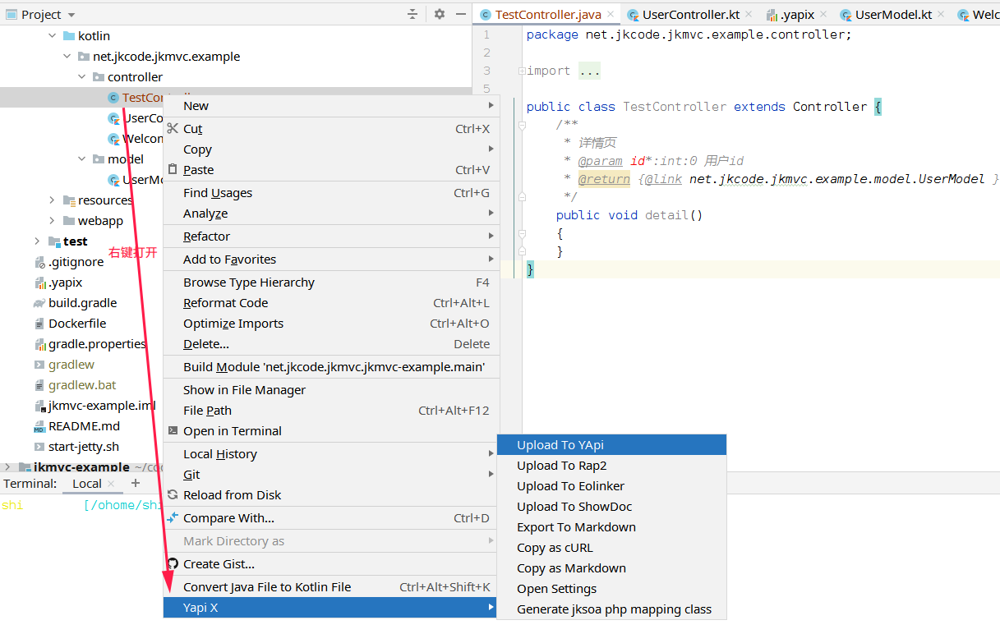

# 生成api文档

我们使用idea插件`jk-yapix`, 根据controller类的javadoc中导出api接口信息

## 1 controller类注释格式
1. 请求参数格式为 `@param 参数名*:类型=默认值`，其中`*`表示必填
2. 返回值（响应）格式为`@return [类名]`，响应数据结构优先取方法注释中`@return`链接的类，如果没有再取方法返回值类型;

例子：参考[UserController.kt](/jkmvc-example/src/main/kotlin/net/jkcode/jkmvc/example/controller/UserController.kt)
```kotlin
/**
 * 详情页
 * @param id:int=0 用户id
 * @return [UserModel]
 */
public fun detail()
```

## 2 插件安装与使用
1. 安装
参考 [jk-yapix](https://plugins.jetbrains.com/plugin/19338-jk-yapix)

2. 使用


3. 我们访问yapi后台即可看到文档

