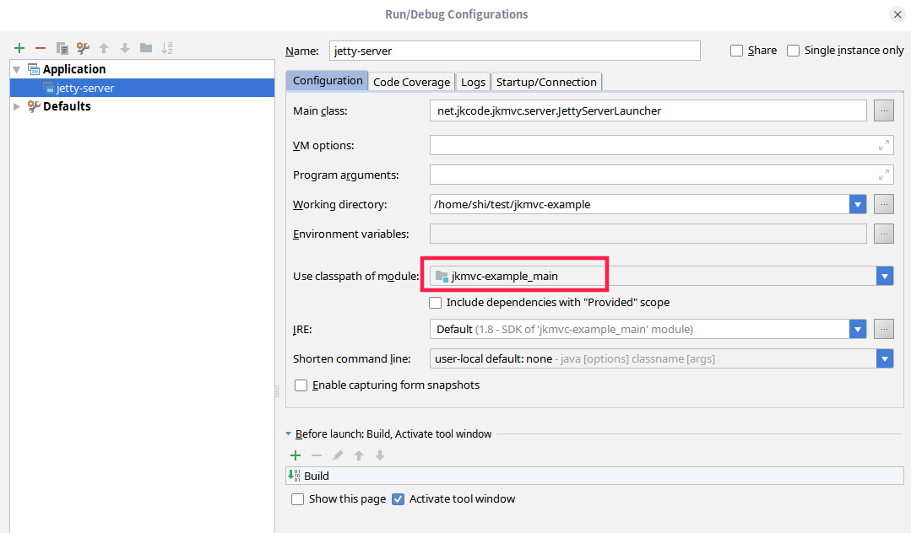

# jetty server

## server配置
vim src/main/resources/jetty.yaml

```
maxThreads: 0 # io线程数, 如果为0则取Runtime.getRuntime().availableProcessors()*8
#host: localhost # The network interface this connector binds to as an IP address or a hostname.  If null or 0.0.0.0 then bind to all interfaces.
port: 8080
# 如果 jkmvc-example 是根目录, 则不需要 jkmvc-example/ 目录前缀
webDir: jkmvc-example/src/main/webapp
contextPath: /jkmvc-example
logDir: logs
tempDir: tmp
```

## 启动server
启动主类 `net.jkcode.jkmvc.server.JettyServerLauncher`

如果你在idea中通过`Run/Debug Configurations` -> `Application`启动, 请注意指定`use classpath of module`
