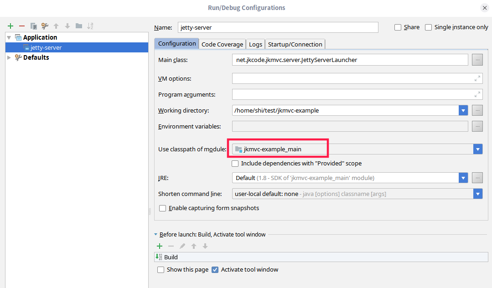

# jetty server

## Server configuration
vim src/main/resources/jetty.yaml

```
maxThreads: 0 # io thread num
#host: localhost # The network interface this connector binds to as an IP address or a hostname.  If null or 0.0.0.0 then bind to all interfaces.
port: 8080
webDir: jkmvc-example/src/main/webapp
contextPath: /jkmvc-example
logDir: logs
tempDir: tmp
```

## Start server
Run the main class `net.jkcode.jkmvc.server.JettyServerLauncher`

If you run through `Run/Debug Configurations` -> `Application` in idea, you must config `use classpath of module`
