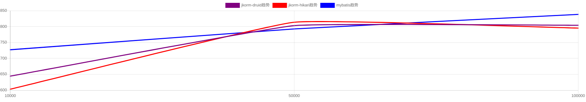

# 第1轮测试结果
主要针对 10万请求级别的结果进行分析

## 结论
1. jkorm-druid vs mybatis
场景 update/delete/getEmpsByIds: 比mybatis好
场景 getEmpsByConditionIf: 性能差不多, 好过mybatis一点点
场景 add/getDepWithEmps/updateEmpOnDynFields: 比mybatis差

=> 删改查jkorm-druid性能更优, 增/联查mybatis更优

2. jkorm-hikari vs mybatis
场景 delete/updateEmpOnDynFields/getEmpsByIds: 比mybatis好
场景 getEmpsByConditionIf: 性能差不多, 好过mybatis一点点
场景 add/update/getDepWithEmps: 比mybatis差

## tps对比(越大越好)
| 测试场景 | jkorm-druid tps | jkorm-hikari tps | mybatis tps  | 性能排序 | jkorm-druid/mybatis比 | jkorm-hikari/mybatis比 | 最优 |
|--------|-----------|---------|--------------|--------------|--------------|--------------|--------------|
| add | 804.19 | 795.3 | 838.45 | mybatis > jkorm-druid > jkorm-hikari| 95.91 % | 94.85 %  | mybatis|
| update | 873.76 | 828.56 | 830.24 | jkorm-druid > mybatis > jkorm-hikari| 105.24 % | 99.80 %  | jkorm-druid|
| delete | 891.25 | 914.0 | 867.37 | jkorm-hikari > jkorm-druid > mybatis| 102.75 % | 105.38 %  | jkorm-hikari|
| getEmpsByConditionIf | 12922.13 | 12847.19 | 12832.92 | jkorm-druid > jkorm-hikari > mybatis| 100.70 % | 100.11 %  | jkorm-druid|
| updateEmpOnDynFields | 848.4 | 910.87 | 867.73 | jkorm-hikari > mybatis > jkorm-druid| 97.77 % | 104.97 %  | jkorm-hikari|
| getEmpsByIds | 13763.93 | 13338.34 | 12124.8 | jkorm-druid > jkorm-hikari > mybatis| 113.52 % | 110.01 %  | jkorm-druid|
| getDepWithEmps | 7772.0 | 8225.29 | 8351.46 | mybatis > jkorm-hikari > jkorm-druid| 93.06 % | 98.49 %  | mybatis|

## 响应耗时对比(越小越好)
| 测试场景 | jkorm-druid rt | jkorm-hikari rt | mybatis rt  | 性能排序 | jkorm-druid/mybatis比 | jkorm-hikari/mybatis比 | 最优 |
|--------|-----------|---------|--------------|--------------|--------------|--------------|--------------|
| add | 1.24 | 1.26 | 1.19 | mybatis > jkorm-druid > jkorm-hikari| 104.20 % | 105.88 %  | mybatis|
| update | 1.14 | 1.21 | 1.2 | jkorm-druid > mybatis > jkorm-hikari| 95.00 % | 100.83 %  | jkorm-druid|
| delete | 1.12 | 1.09 | 1.15 | jkorm-hikari > jkorm-druid > mybatis| 97.39 % | 94.78 %  | jkorm-hikari|
| getEmpsByConditionIf | 0.08 | 0.08 | 0.08 | jkorm-hikari > mybatis > jkorm-druid| 100.00 % | 100.00 %  | jkorm-hikari|
| updateEmpOnDynFields | 1.18 | 1.1 | 1.15 | jkorm-hikari > mybatis > jkorm-druid| 102.61 % | 95.65 %  | jkorm-hikari|
| getEmpsByIds | 0.07 | 0.07 | 0.08 | jkorm-hikari > jkorm-druid > mybatis| 87.50 % | 87.50 %  | jkorm-hikari|
| getDepWithEmps | 0.13 | 0.12 | 0.12 | mybatis > jkorm-hikari > jkorm-druid| 108.33 % | 100.00 %  | mybatis|

## 1. 场景 `add`
结果

tps对比

耗时对比

## 2. 场景 `update`
结果

tps对比

耗时对比

## 3. 场景 `delete`
结果

tps对比

耗时对比

## 4. 场景 `getDepWithEmps`
结果

tps对比

耗时对比

## 5. 场景 `getEmpsByConditionIf`
结果

tps对比

耗时对比

## 6. 场景 `updateEmpOnDynFields`
结果

tps对比

耗时对比

## 7. 场景 `getEmpsByIds`
结果

tps对比

耗时对比

