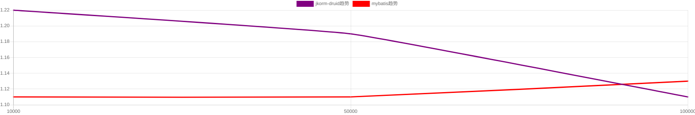
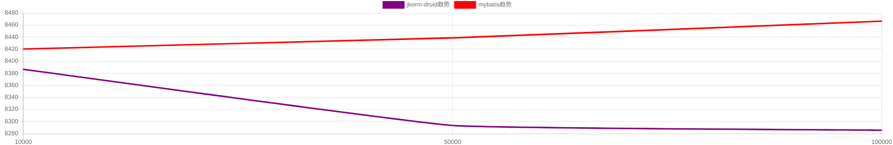

# 第2轮测试优化

## 测试主体简化
在上一次测试中, jkorm-druid 比 jkorm-hikari 性能好, 因此本次测试不处理 jkorm-hikari 

## 测试方法优化
每个场景的方法都会分别运行 1w/5w/10w 次的测试, 来获得测试结果
为了让测试结果更加可靠, 每个场景的测试都会运行`3轮`, 取性能最好(耗时最短)的结果

## jkorm代码优化
经过前一次的性能对比, 发现场景 add/getDepWithEmps/updateEmpOnDynFields: jkorm-druid比mybatis差, 发现对应场景的代码有优化的余地.

1. 优化场景`add`
优化`OrmPersistent#removeCache()`方法实现:
`OrmMeta` 使用 `relationsCacheThis` 属性保存, 缓存当前对象的关联关系, 不让他在每次运行时每次都计算

2. 优化场景 `getDepWithEmps` 
优化改用 `Department.findByPk()`
```
    /**
     * 部门联查员工
     */
    public fun getDepWithEmps(i: Int): Int {
        /*
        val dep = Department.queryBuilder()
                .where("id", i)
                .findModel<Department>()
        */
        val dep = Department.findByPk<Department>(i)
        val emps = dep?.emps
        return 2
    }
```

# 第2轮测试结果
主要针对 10万请求级别的结果进行分析

## 结论
jkorm-druid 总体优于 mybatis

1. 除了场景 `getDepWithEmps`, jkorm-druid 差过 mybatis, 差2.14%;

2. 其他所有场景, jkorm-druid 都优于 mybatis:
场景`delete`差不多
场景`add`/`update`/`getEmpsByConditionIf`/`updateEmpOnDynFields`都优于1%~2.67%
场景`getEmpsByIds` 优于11.24%, 优太多

## tps对比(越大越好)
| 测试场景 | jkorm-druid tps | mybatis tps  | 性能排序 | jkorm-druid/mybatis |  最优 |
|--------|-----------|---------|--------------|--------------|--------------|--------------|
| add | 897.41 | 886.68 | jkorm-druid > mybatis| 101.21 %  | jkorm-druid|
| update | 884.88 | 871.26 | jkorm-druid > mybatis| 101.56 %  | jkorm-druid|
| delete | 878.65 | 878.21 | jkorm-druid > mybatis| 100.05 %  | jkorm-druid|
| getEmpsByConditionIf | 13310.7 | 12964.26 | jkorm-druid > mybatis| 102.67 %  | jkorm-druid|
| updateEmpOnDynFields | 879.52 | 867.48 | jkorm-druid > mybatis| 101.39 %  | jkorm-druid|
| getEmpsByIds | 13876.07 | 12473.92 | jkorm-druid > mybatis| 111.24 %  | jkorm-druid|
| getDepWithEmps | 8285.65 | 8466.51 | mybatis > jkorm-druid| 97.86 %  | mybatis|


## 响应耗时对比(越小越好)
| 测试场景 | jkorm-druid rt | mybatis rt  | 性能排序 | jkorm-druid/mybatis |  最优 |
|--------|-----------|---------|--------------|--------------|--------------|--------------|
| add | 1.11 | 1.13 | jkorm-druid > mybatis| 98.23 %  | jkorm-druid|
| update | 1.13 | 1.16 | jkorm-druid > mybatis| 97.41 %  | jkorm-druid|
| delete | 1.14 | 1.14 | jkorm-druid > mybatis| 100.00 %  | jkorm-druid|
| getEmpsByConditionIf | 0.07 | 0.08 | jkorm-druid > mybatis| 87.50 %  | jkorm-druid|
| updateEmpOnDynFields | 1.14 | 1.15 | jkorm-druid > mybatis| 99.13 %  | jkorm-druid|
| getEmpsByIds | 0.07 | 0.08 | jkorm-druid > mybatis| 87.50 %  | jkorm-druid|
| getDepWithEmps | 0.12 | 0.12 | jkorm-druid > mybatis| 100.00 %  | jkorm-druid|

## 1. 场景 `add`
结果


tps对比


耗时对比


## 2. 场景 `update`
结果


tps对比


耗时对比


## 3. 场景 `delete`
结果


tps对比


耗时对比


## 4. 场景 `getDepWithEmps`
结果


tps对比


耗时对比


## 5. 场景 `getEmpsByConditionIf`
结果


tps对比


耗时对比


## 6. 场景 `updateEmpOnDynFields`
结果


tps对比


耗时对比


## 7. 场景 `getEmpsByIds`
结果


tps对比


耗时对比

